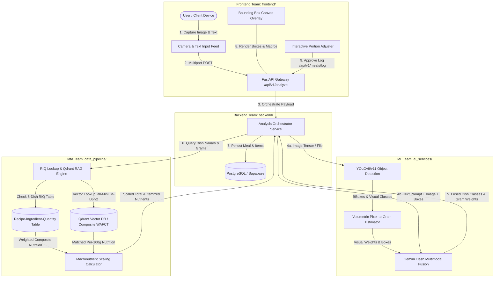
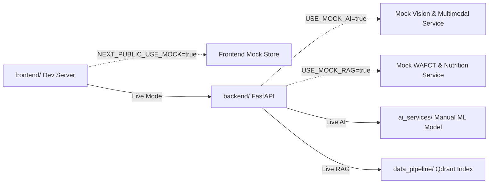

# docta: Master Project Orchestration Blueprint

## 1. Executive Summary & System Vision
**docta** is an edge-optimized, multimodal, and localized nutrition intelligence platform engineered specifically for African and Nigerian dietary compositions. It bridges the critical accuracy gap in mainstream global diet-tracking applications by integrating:
1. Custom-trained Computer Vision (YOLOv8/v11) specialized on complex, mixed, and stew-heavy West African dishes (managed by the ML Team in `ai_services/`).
2. Geometric volumetric portion estimation coupled with localized food density tables.
3. Multimodal Large Language Model (Gemini Flash) vision-text reasoning for conversational disambiguation and portion overrides.
4. High-performance Retrieval-Augmented Generation (RAG) powered by Qdrant Vector Search over the FAO/INFOODS West African Food Composition Table (WAFCT 2019) (managed in `data_pipeline/`).
5. Asynchronous, high-throughput microservices architecture delivering end-to-end meal analysis in under 2.0 seconds (managed in `backend/`).
6. Mobile-first Progressive Web App (PWA) with WebRTC camera capture and interactive bounding box canvas (managed in `frontend/`).

---

## 2. Directory Structure & Team Ownership

```
docta/
├── ai_services/                       # [ML Team] Manual YOLO Training, Volumetric & Gemini Multimodal Fusion
│   └── INSTRUCTION.md                 # ML Engineer Integration & Model Connection Guide
├── data_pipeline/                     # [Data/RAG Team] FAO WAFCT 2019 Ingestion, Qdrant Vector Search & Scaling
│   └── INSTRUCTION.md                 # Data Team & Autonomous Agent Instructions
├── backend/                           # [Backend Team] FastAPI Gateway, PostgreSQL, JWT Auth, Orchestrator
│   └── INSTRUCTION.md                 # Backend Team & Autonomous Agent Instructions
├── frontend/                          # [Frontend Team] Next.js 14 PWA, WebRTC Camera, Canvas Overlay, Dashboard
│   └── INSTRUCTION.md                 # Frontend Team & Autonomous Agent Instructions
├── PROJECT_ORCHESTRATION.md           # Master System Blueprint, Mock Strategy & API Contracts
└── README.md
```

---

## 3. End-to-End System Architecture & Dataflow



---

## 4. Independent Development & Dummy Content Strategy

To ensure each team can develop and test independently without blocking each other, every module is equipped with **Dummy / Mock Fallback Modes**.



### 4.1. Mock Configuration by Module

| Module | Mock Trigger Environment Flag | Fallback Behavior When Live Service Is Unavailable |
| :--- | :--- | :--- |
| **`frontend/`** | `NEXT_PUBLIC_USE_MOCK=true` | Returns hardcoded sample analysis with bounding boxes, simulated delay (800ms), and mock dashboard summary. Runs with zero backend dependency. |
| **`backend/`** | `USE_MOCK_AI=true`<br>`USE_MOCK_RAG=true` | Injects deterministic mock AI responses (`jollof_rice`, `fried_plantain`) and mock RAG macro calculations. Database and Auth remain fully testable without GPU or Qdrant running. |
| **`data_pipeline/`** | `USE_IN_MEMORY_FALLBACK=true` | Serves semantic searches and scaling queries directly from `data/fallback_defaults.json` and in-memory WAFCT seed data when Qdrant is offline. |
| **`ai_services/`** | `USE_STUB_PREDICTOR=true` | Exposes a lightweight stub predictor that simulates YOLO bounding boxes and Gemini Flash fusion outputs while the ML engineer performs manual dataset training. |

---

## 5. ML Engineer Hand-off & Model Connection Guide

> [!NOTE]
> All AI model training (dataset curation, labeling, hyperparameter tuning, YOLO training) is performed **manually by the ML Team**. Coding agents should NOT attempt automated model training.

### How to Connect the Manually Trained Model to the Application:
1. **Export Trained Weights**: The ML engineer trains the model manually on GPU hardware and exports the final PyTorch weights to:
   ```
   ai_services/models/weights/best.pt
   ```
2. **Update Portion & Density Registry**: Populate `ai_services/models/portion_density.json` with empirical food density ($\text{g/cm}^3$) and depth factors.
3. **Configure Gemini Flash API Key**: Set `GEMINI_API_KEY` in `.env` for multimodal vision-text reasoning.
4. **Expose Inference Entrypoint**: Ensure `ai_services/src/pipeline.py` implements the standard `analyze_image(image_bytes, text_prompt=None)` method.
5. **Switch Backend Flag**: In `backend/.env`, toggle `USE_MOCK_AI=false`. The backend orchestrator will automatically load and run the live inference pipeline.

---

## 6. Canonical Shared API Contracts & Data Types

All sub-teams and mock generators must strictly align with these standardized schemas.

### 6.1. Bounding Box Coordinates
All bounding box coordinates are normalized floats in the range $[0.0, 1.0]$:
$$\text{bbox} = [x_{\min}, y_{\min}, x_{\max}, y_{\max}]$$

### 6.2. Master JSON Payload Schemas

#### A. Intermediate AI Detection Payload (`ai_services` $\rightarrow$ `backend`)
```json
{
  "detected_items": [
    {
      "dish_id": "jollof_rice",
      "display_name": "Jollof Rice",
      "confidence": 0.93,
      "bounding_box": [0.125, 0.240, 0.550, 0.780],
      "estimated_volume_cm3": 320.5,
      "density_g_cm3": 0.85,
      "estimated_weight_g": 272.4,
      "text_override_applied": false,
      "reasoning": "Standard single scoop portion detected via bounding box area ratio."
    },
    {
      "dish_id": "fried_plantain",
      "display_name": "Fried Plantain (Dodo)",
      "confidence": 0.89,
      "bounding_box": [0.580, 0.310, 0.890, 0.650],
      "estimated_volume_cm3": 140.0,
      "density_g_cm3": 0.78,
      "estimated_weight_g": 150.0,
      "text_override_applied": true,
      "reasoning": "User prompt specified '4 slices of dodo', overriding visual estimate of 109g to 150g."
    }
  ],
  "raw_prompt": "Jollof with 4 slices of dodo",
  "processing_time_ms": 780.5
}
```

#### B. Full Analyze Meal Response (`backend` $\rightarrow$ `frontend`)
`POST /api/v1/analyze`
```json
{
  "analysis_id": "anlz_8f92c10b",
  "status": "success",
  "processing_duration_ms": 1140.2,
  "image_url": "https://storage.docta.ng/meals/temp_8f92c10b.jpg",
  "detected_items": [
    {
      "item_id": "item_1",
      "dish_id": "jollof_rice",
      "display_name": "Nigerian Jollof Rice",
      "confidence": 0.93,
      "bounding_box": [0.125, 0.240, 0.550, 0.780],
      "weight_g": 272.0,
      "wafct_code": "01_042",
      "similarity_score": 0.942,
      "is_fallback": false,
      "nutrients": {
        "calories_kcal": 380.8,
        "protein_g": 7.3,
        "fat_g": 10.9,
        "carbs_g": 62.6,
        "fiber_g": 2.7,
        "sodium_mg": 489.6,
        "calcium_mg": 21.8,
        "iron_mg": 1.9
      }
    },
    {
      "item_id": "item_2",
      "dish_id": "fried_plantain",
      "display_name": "Fried Ripe Plantain (Dodo)",
      "confidence": 0.89,
      "bounding_box": [0.580, 0.310, 0.890, 0.650],
      "weight_g": 150.0,
      "wafct_code": "02_018",
      "similarity_score": 0.961,
      "is_fallback": false,
      "nutrients": {
        "calories_kcal": 312.0,
        "protein_g": 1.8,
        "fat_g": 14.1,
        "carbs_g": 48.0,
        "fiber_g": 3.6,
        "sodium_mg": 6.0,
        "calcium_mg": 15.0,
        "iron_mg": 0.9
      }
    }
  ],
  "total_nutrition": {
    "total_calories_kcal": 692.8,
    "total_protein_g": 9.1,
    "total_fat_g": 25.0,
    "total_carbs_g": 110.6,
    "total_fiber_g": 6.3,
    "total_sodium_mg": 495.6,
    "total_calcium_mg": 36.8,
    "total_iron_mg": 2.8
  }
}
```

#### C. Log Approved Meal Request (`frontend` $\rightarrow$ `backend`)
`POST /api/v1/meals/log`
```json
{
  "analysis_id": "anlz_8f92c10b",
  "image_url": "https://storage.docta.ng/meals/temp_8f92c10b.jpg",
  "meal_type": "lunch",
  "logged_at": "2026-09-22T13:45:00Z",
  "items": [
    {
      "food_name": "Nigerian Jollof Rice",
      "wafct_code": "01_042",
      "gram_weight": 250.0,
      "calories_kcal": 350.0,
      "protein_g": 6.7,
      "fat_g": 10.0,
      "carbs_g": 57.5,
      "fiber_g": 2.5,
      "sodium_mg": 450.0,
      "calcium_mg": 20.0,
      "iron_mg": 1.75
    },
    {
      "food_name": "Fried Ripe Plantain (Dodo)",
      "wafct_code": "02_018",
      "gram_weight": 150.0,
      "calories_kcal": 312.0,
      "protein_g": 1.8,
      "fat_g": 14.1,
      "carbs_g": 48.0,
      "fiber_g": 3.6,
      "sodium_mg": 6.0,
      "calcium_mg": 15.0,
      "iron_mg": 0.9
    }
  ]
}
```

#### D. Dashboard Daily Summary (`backend` $\rightarrow$ `frontend`)
`GET /api/v1/dashboard/summary?date=2026-09-22`
```json
{
  "date": "2026-09-22",
  "user_id": "usr_99a812ef",
  "calorie_target_kcal": 2200,
  "calorie_consumed_kcal": 1450.5,
  "remaining_calories_kcal": 749.5,
  "target_macros": {
    "protein_target_g": 120.0,
    "fat_target_g": 65.0,
    "carbs_target_g": 275.0
  },
  "consumed_macros": {
    "protein_consumed_g": 78.4,
    "fat_consumed_g": 49.2,
    "carbs_consumed_g": 182.1,
    "fiber_consumed_g": 16.8,
    "sodium_consumed_mg": 1320.0
  },
  "meals_logged": [
    {
      "meal_id": "meal_412",
      "meal_type": "breakfast",
      "logged_at": "2026-09-22T08:15:00Z",
      "calories_kcal": 420.0,
      "thumbnail_url": "https://storage.docta.ng/meals/thumb_412.jpg",
      "summary_text": "Moi Moi (200g), Boiled Egg (50g)"
    },
    {
      "meal_id": "meal_413",
      "meal_type": "lunch",
      "logged_at": "2026-09-22T13:45:00Z",
      "calories_kcal": 1030.5,
      "thumbnail_url": "https://storage.docta.ng/meals/thumb_413.jpg",
      "summary_text": "Jollof Rice (250g), Dodo (150g), Suya (120g)"
    }
  ]
}
```

---

## 7. Inter-Team Integration Rules & Best Practices

1. **Strict Folder Boundaries**: Each team or agent must restrict changes to its designated directory (`ai_services/`, `data_pipeline/`, `backend/`, `frontend/`).
2. **Mock-First Verification**: Always ensure your module can build, run, and pass tests in Mock mode prior to integrating with live counterpart services.
3. **Contract Stability**: Modifying schema definitions in Section 6 requires cross-team consensus.
4. **Environment Configuration**: Store all URLs, keys, and mock switches in `.env` files matching the project standards.
