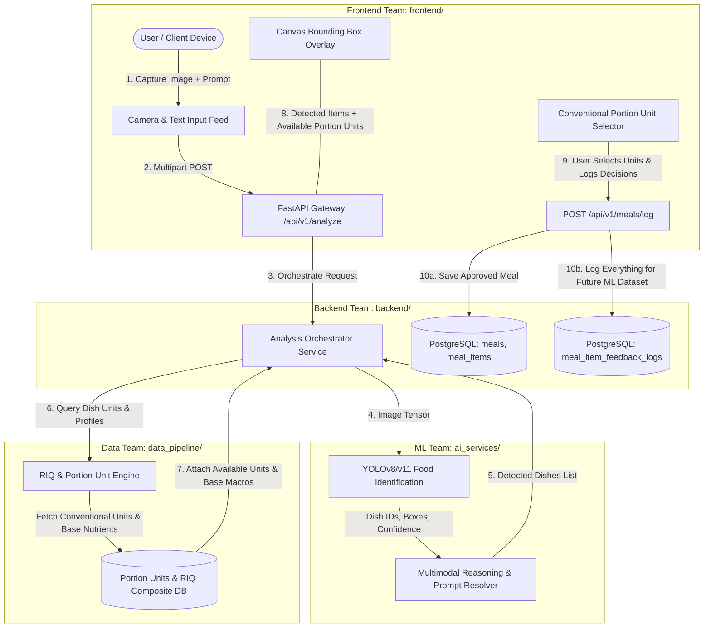

# docta: Master Project Orchestration Blueprint

## 1. Executive Summary & Core Architectural Pivot
**docta** is an edge-optimized, multimodal nutrition intelligence platform engineered specifically for African and Nigerian dietary compositions. 

### Core Architectural Pivot:
1. **Computer Vision Scope (Identification Only)**: The CV model is trained **strictly on food identification and localization** (bounding box + dish classification). Automated volumetric pixel-to-gram weight estimation in CV is removed to maximize detection accuracy and eliminate unreliable depth heuristics.
2. **Conventional Portion Units of Measurement Lookup**: Every supported dish is mapped to standard, culturally conventional units of measurement (e.g. *Serving Spoons*, *Wraps (Small/Medium/Large)*, *Slices*, *Pieces*, *Takeaway Packs*).
3. **Interactive User Quantity Selection**: When the CV model detects one or more foods in an image, the application presents the recognized items alongside their conventional measurement units. The user selects the unit and quantity (or modifies the predicted food label).
4. **Recipe-Ingredient-Quantity (RIQ) Nutritional Scaling**: Selected conventional units convert to standardized gram equivalents, which are calculated against composite WAFCT nutrition profiles.
5. **Comprehensive Decision & Active Learning Logging ("Log Everything")**: Every prediction, user label correction, selected portion unit, quantity, and final gram weight is persistently logged in a dedicated telemetry store. This creates the continuous ground-truth dataset required to train future automated portion-size models and identify missing food classes.

---

## 2. Directory Structure & Team Ownership

```
docta/
├── ai_services/                       # [ML Team] Manual YOLO Classification, Portion Units Registry, Gemini Reasoning
│   └── INSTRUCTION.md                 # ML Engineer Integration & Model Connection Guide
├── data_pipeline/                     # [Data/RAG Team] RIQ Lookup, Conventional Portion Units, WAFCT Ingestion & Scaling
│   └── INSTRUCTION.md                 # Data Team & Autonomous Agent Instructions
├── backend/                           # [Backend Team] FastAPI Gateway, Decision Logging, DB Models, JWT Auth, Orchestrator
│   └── INSTRUCTION.md                 # Backend Team & Autonomous Agent Instructions
├── frontend/                          # [Frontend Team] Next.js 14 PWA, Multi-Food Conventional Unit Selector, Canvas Overlay
│   └── INSTRUCTION.md                 # Frontend Team & Autonomous Agent Instructions
├── PROJECT_ORCHESTRATION.md           # Master System Blueprint, Mock Strategy & Shared API Contracts
└── README.md
```

---

## 3. End-to-End System Architecture & Dataflow



---

## 4. "Log Everything" Active Learning Strategy

To train automated portion-size models in future iterations and track diet trends, the backend logs complete decision metadata for **every detected item**:

| Telemetry Field | Data Type | Description & Purpose |
| :--- | :--- | :--- |
| `image_url` | String | Reference to captured meal image for future dataset training. |
| `predicted_dish_id` | String | Raw dish class predicted by the CV model. |
| `predicted_confidence`| Float | Confidence score of the CV prediction ($0.0 - 1.0$). |
| `bounding_box` | Array | `[x_min, y_min, x_max, y_max]` localization coordinates. |
| `final_dish_id` | String | Final dish chosen by the user (allows detecting misclassifications). |
| `label_modified` | Boolean | `true` if user corrected the CV prediction; `false` otherwise. |
| `selected_unit_id` | String | Conventional portion unit chosen (e.g., `"serving_spoon"`, `"medium_wrap"`). |
| `selected_quantity` | Float | Multiplier chosen by user (e.g., `2.0` spoons, `1.5` wraps). |
| `calculated_gram_weight`| Float | Resulting gram mass ($\text{unit\_grams} \times \text{quantity}$). |
| `custom_weight_entered_g`| Float / Null | Populated if user manually entered raw grams instead of units. |

---

## 5. Independent Development & Dummy Content Strategy

| Module | Mock Flag | Standalone Behavior Without External Dependencies |
| :--- | :--- | :--- |
| **`frontend/`** | `NEXT_PUBLIC_USE_MOCK=true` | Simulates multi-dish detection (Jollof Rice + Plantain) with available conventional portion units, unit selectors, instant macro recalculations, and telemetry logging simulation. |
| **`backend/`** | `USE_MOCK_AI=true`<br>`USE_MOCK_RAG=true` | Returns mock dish classifications with attached conventional portion units. Persists meals, items, and feedback telemetry to PostgreSQL without requiring live ML models or Qdrant. |
| **`data_pipeline/`** | `USE_IN_MEMORY_FALLBACK=true` | Loads 5-dish RIQ recipes and portion units table directly from local JSON files. |
| **`ai_services/`** | `USE_STUB_PREDICTOR=true` | Emits mock bounding boxes and food IDs for independent backend development. |

---

## 6. Canonical Shared API Contracts & Data Types

### 6.1. Conventional Portion Unit Model
```json
{
  "unit_id": "serving_spoon",
  "unit_name": "Serving Spoon",
  "gram_weight": 120.0,
  "description": "Standard cooking/catering spoon (~120g)"
}
```

### 6.2. Full Analyze Meal Response (`backend` $\rightarrow$ `frontend`)
`POST /api/v1/analyze`
```json
{
  "analysis_id": "anlz_8f92c10b",
  "status": "success",
  "processing_duration_ms": 780.2,
  "image_url": "https://storage.docta.ng/meals/temp_8f92c10b.jpg",
  "detected_items": [
    {
      "item_id": "item_1",
      "predicted_dish_id": "jollof_rice",
      "display_name": "Nigerian Jollof Rice",
      "confidence": 0.94,
      "bounding_box": [0.125, 0.240, 0.550, 0.780],
      "default_unit_id": "serving_spoon",
      "default_quantity": 2.0,
      "default_weight_g": 240.0,
      "available_portion_units": [
        { "unit_id": "serving_spoon", "unit_name": "Serving Spoon", "gram_weight": 120.0, "description": "Standard cooking spoon (~120g)" },
        { "unit_id": "mound_cup", "unit_name": "Mound / Cup", "gram_weight": 250.0, "description": "Standard plate mound (~250g)" },
        { "unit_id": "takeaway_pack", "unit_name": "Takeaway Pack", "gram_weight": 500.0, "description": "Full standard plastic pack (~500g)" }
      ],
      "nutrients_per_100g": {
        "calories_kcal": 140.0,
        "protein_g": 2.7,
        "fat_g": 4.0,
        "carbs_g": 23.0,
        "fiber_g": 1.0,
        "sodium_mg": 180.0,
        "calcium_mg": 8.0,
        "iron_mg": 0.7
      }
    },
    {
      "item_id": "item_2",
      "predicted_dish_id": "fried_plantain",
      "display_name": "Fried Ripe Plantain (Dodo)",
      "confidence": 0.89,
      "bounding_box": [0.580, 0.310, 0.890, 0.650],
      "default_unit_id": "portion_6_slices",
      "default_quantity": 1.0,
      "default_weight_g": 150.0,
      "available_portion_units": [
        { "unit_id": "single_slice", "unit_name": "Single Slice / Piece", "gram_weight": 25.0, "description": "One slice (~25g)" },
        { "unit_id": "portion_6_slices", "unit_name": "Small Portion (6 slices)", "gram_weight": 150.0, "description": "Side portion (~150g)" },
        { "unit_id": "large_portion", "unit_name": "Large Portion (12 slices)", "gram_weight": 300.0, "description": "Main side portion (~300g)" }
      ],
      "nutrients_per_100g": {
        "calories_kcal": 208.0,
        "protein_g": 1.2,
        "fat_g": 9.4,
        "carbs_g": 32.0,
        "fiber_g": 2.4,
        "sodium_mg": 4.0,
        "calcium_mg": 10.0,
        "iron_mg": 0.6
      }
    }
  ]
}
```

### 6.3. Log Approved Meal with Decision Telemetry (`frontend` $\rightarrow$ `backend`)
`POST /api/v1/meals/log`
```json
{
  "analysis_id": "anlz_8f92c10b",
  "image_url": "https://storage.docta.ng/meals/temp_8f92c10b.jpg",
  "meal_type": "lunch",
  "logged_at": "2026-09-24T13:45:00Z",
  "items": [
    {
      "item_id": "item_1",
      "food_name": "Nigerian Jollof Rice",
      "predicted_dish_id": "jollof_rice",
      "final_dish_id": "jollof_rice",
      "label_modified": false,
      "confidence": 0.94,
      "bounding_box": [0.125, 0.240, 0.550, 0.780],
      "selected_unit_id": "serving_spoon",
      "selected_quantity": 2.0,
      "gram_weight": 240.0,
      "calories_kcal": 336.0,
      "protein_g": 6.48,
      "fat_g": 9.6,
      "carbs_g": 55.2,
      "fiber_g": 2.4,
      "sodium_mg": 432.0,
      "calcium_mg": 19.2,
      "iron_mg": 1.68
    },
    {
      "item_id": "item_2",
      "food_name": "Fried Ripe Plantain (Dodo)",
      "predicted_dish_id": "fried_plantain",
      "final_dish_id": "fried_plantain",
      "label_modified": false,
      "confidence": 0.89,
      "bounding_box": [0.580, 0.310, 0.890, 0.650],
      "selected_unit_id": "portion_6_slices",
      "selected_quantity": 1.0,
      "gram_weight": 150.0,
      "calories_kcal": 312.0,
      "protein_g": 1.8,
      "fat_g": 14.1,
      "carbs_g": 48.0,
      "fiber_g": 3.6,
      "sodium_mg": 6.0,
      "calcium_mg": 15.0,
      "iron_mg": 0.9
    }
  ]
}
```

---

## 7. Inter-Team Integration Protocol

1. **AI Team (`ai_services/`)**: Focuses 100% on high-accuracy multi-class food identification. Emits `dish_id`, bounding boxes, and confidence.
2. **Data Team (`data_pipeline/`)**: Maintains the 5-dish RIQ composite nutrition and the conventional portion unit registry with gram mappings.
3. **Backend Team (`backend/`)**: Merges CV detections with portion unit options, computes scaled macros upon selection, and persists all user decisions to `meal_item_feedback_logs`.
4. **Frontend Team (`frontend/`)**: Renders interactive cards with unit pickers and quantity steppers for each detected item, enabling instant real-time nutrition calculation and telemetry dispatch.
