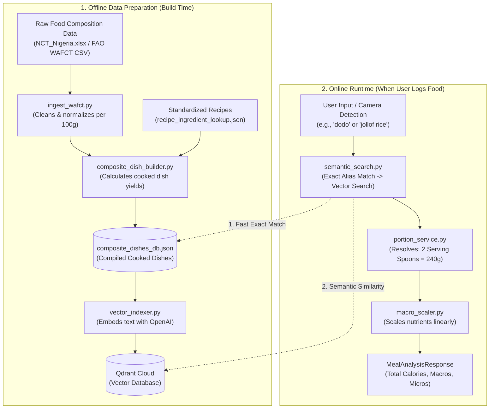
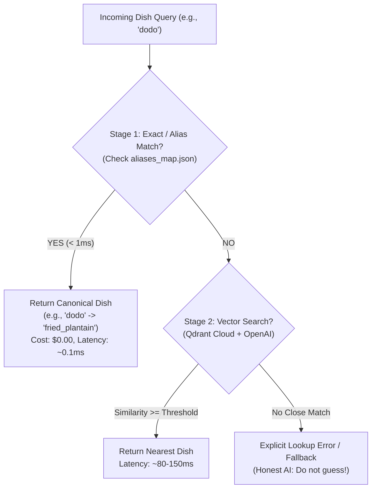

# Beginner's Guide to the Data Pipeline & RAG in Docta
### *A Layman's Walkthrough with Data Science Connections for Beginners*

---

## 🌟 Welcome! Who is this document for?

If you are new to software engineering, just starting your journey in **Data Science**, or wondering what the buzzword **RAG (Retrieval-Augmented Generation)** actually means in a real-world production application, you are in the right place!

This guide walks you step-by-step through the **Data Pipeline and RAG system** located in `backend/src/data_pipeline`. 

We will avoid confusing jargon wherever possible, use intuitive everyday analogies, break down the technical code step-by-step, and explicitly highlight **Data Science Connections** so you can connect this codebase to what you learn in data science, linear algebra, and machine learning courses.

---

## 📑 Table of Contents

1. [The Real-World Problem: Why Does This Exist?](#1-the-real-world-problem-why-does-this-exist)
2. [The Golden Rule: Probabilistic AI vs. Deterministic Math](#2-the-golden-rule-probabilistic-ai-vs-deterministic-math)
3. [What is RAG? The Open-Book Exam Analogy](#3-what-is-rag-the-open-book-exam-analogy)
4. [High-Level Architecture at a Glance](#4-high-level-architecture-at-a-glance)
5. [Stage 1: Data Ingestion & Cleaning (The 'E' and 'T' of ETL)](#5-stage-1-data-ingestion--cleaning-the-e-and-t-of-etl)
   - *Data Science Connection: Handling Missing Data & Normalization*
6. [Stage 2: Composite Dish Building & Recipe Science](#6-stage-2-composite-dish-building--recipe-science)
   - *Data Science Connection: Feature Engineering & Weighted Averages*
7. [Stage 3: Vector Embeddings & The Vector Database (Qdrant)](#7-stage-3-vector-embeddings--the-vector-database-qdrant)
   - *Data Science Connection: Vectors, Latent Spaces & Cosine Similarity*
8. [Stage 4: Semantic Search & Two-Stage Retrieval](#8-stage-4-semantic-search--two-stage-retrieval)
   - *Data Science Connection: Fast Lookup Tables vs. Approximate Nearest Neighbors (ANN)*
9. [Stage 5: Portion Sizing & Macro Scaling](#9-stage-5-portion-sizing--macro-scaling)
   - *Data Science Connection: Linear Scaling & Dimensional Analysis*
10. [Tour of the Codebase (`backend/src/data_pipeline/`)](#10-tour-of-the-codebase)
11. [Data Science Glossary & Key Takeaways](#11-data-science-glossary--key-takeaways)

---

## 1. The Real-World Problem: Why Does This Exist?

Imagine a user sits down in Lagos or London to eat lunch. On their plate is a generous portion of **Nigerian Jollof Rice**, **Fried Plantain (Dodo)**, and a piece of **Beef**.

They open the **Docta** app and snap a photo. They want to know:
- *How many calories am I eating?*
- *How much protein, fat, carbohydrates, and dietary fiber are in this meal?*
- *What about micronutrients like sodium, calcium, and iron?*

### Why is this hard?
1. **Raw Ingredients vs. Cooked Dishes**: Nutrition tables published by global health agencies (like the United Nations FAO or national health ministries) usually test **raw ingredients** (e.g., raw white rice, raw palm oil, canned tomato paste, raw onions). Nobody eats raw rice and raw palm oil! People eat cooked, seasoned Jollof Rice.
2. **Cultural Serving Sizes**: People don't carry digital kitchen scales to lunch. A Nigerian user will tell you: *"I had 2 serving spoons of Jollof rice, 6 slices of dodo, and 1 wrap of Amala."*
3. **Language & Dialects**: One person says *"fried ripe plantain"*, another says *"dodo"*, and someone else might say *"alloco"*. The system must understand they mean the exact same food.

The folder `backend/src/data_pipeline` was built to solve these exact problems.

---

## 2. The Golden Rule: Probabilistic AI vs. Deterministic Math

Before writing a single line of code, the Docta team established a core engineering principle that is vital for every data science student to understand:

> 💡 **The Golden Rule**:
> **Perception is Probabilistic (AI). Calculation is Deterministic (Code & Math).**

### What does this mean?
- **Large Language Models (like ChatGPT)** and **Computer Vision Models (like YOLO)** are **probabilistic**. They guess patterns based on probabilities. If you ask a language model: *"How many calories are in 200g of Egusi soup?"*, it might say 350 kcal today, 480 kcal tomorrow, and 200 kcal the day after. In machine learning, this is called **hallucination**.
- In healthcare and nutrition, hallucinations can be harmful. A diabetic patient cannot rely on a guess.
- Therefore, we divide the work strictly:
  1. **Computer Vision (AI)** is ONLY allowed to say: *"I see Jollof Rice with 95% confidence."*
  2. The **RAG & Nutrition Pipeline (Math + Data)** looks up the authoritative food table, asks for the portion size, and calculates the exact grams and calories using pure arithmetic ($2 \times 120\text{g} = 240\text{g}$).

---

## 3. What is RAG? The Open-Book Exam Analogy

**RAG** stands for **Retrieval-Augmented Generation**. 

If you have never heard this term before, think of it as taking an **Open-Book Exam**:

```
Closed-Book Exam (Traditional AI)
----------------------------------
Student takes test with NO book.
Must remember facts from memory.
Risk: Might remember incorrectly or make things up (hallucinate).

Open-Book Exam (RAG Architecture)
----------------------------------
1. RETRIEVAL: Student is given a verified textbook (the Food Composition Database).
2. AUGMENTATION: When asked a question, student flips to the exact verified chapter.
3. GENERATION / CALCULATION: Student uses the verified textbook data to formulate the answer.
```

In Docta's RAG system:
- **Retrieval**: When the user or camera submits "Nigerian Jollof", the system retrieves the verified scientific profile from a specialized database called **Qdrant**.
- **Augmentation**: The system augments the meal query with verified nutrient numbers (calories, protein, fat per 100g) and available household portion options (serving spoons, mounds, takeaway packs).
- **Generation**: Instead of generating uncontrolled text, the system deterministically generates a mathematically scaled nutritional report.

---

## 4. High-Level Architecture at a Glance

Here is how data flows from raw scientific Excel sheets all the way to a user's phone:



---

## 5. Stage 1: Data Ingestion & Cleaning (The 'E' and 'T' of ETL)

**File:** [`ingest_wafct.py`](file:///c:/projects/docta/backend/src/data_pipeline/src/ingest_wafct.py)

In data science, real-world data is almost never clean. It comes from government research agencies, universities, and international food bodies in messy Excel spreadsheets (`.xlsx`) or comma-separated files (`.csv`).

### What does `ingest_wafct.py` do?
1. **Reads Raw Files**: It loads `data/NCT_Nigeria.xlsx` (Nigerian Food Composition Table) and `data/raw_wafct_2019.csv` (FAO West African Food Composition Table).
2. **Standardizes Column Synonyms**: In one file, protein is called `"protein_g"`. In another, it is called `"procnt"` or `"protein, total (g)"`. The script maps all these variations to one unified schema:
   ```python
   COLUMN_MAPPING = {
       "calories_kcal": ["energy_kcal", "calories_kcal", "enerc_kcal", "energy"],
       "protein_g": ["protein_g", "protein", "procnt_g", "procnt"],
       "fat_g": ["fat_g", "fat", "total_fat", "fatce"],
       "carbs_g": ["carbs_g", "carbohydrates", "choavl_g"],
       # ...
   }
   ```
3. **Cleans Missing & Dirty Values**: In scientific tables, if a nutrient is negligible, researchers write `"[T]"` (trace), `"tr"`, `"-"`, `"nd"` (not detected), or `"N/A"`. If you try to do math on `"[T]"`, Python will crash! The function `_clean_numeric_value()` converts all of these safely into `0.0`.

---
> 🧠 **Data Science Connection #1: Data Munging & Missing Value Imputation**
> In any data science project, ~80% of your time is spent on **ETL (Extract, Transform, Load)** and data cleaning. Replacing dirty string values like `"tr"` with `0.0` or handling `NaN` (Not a Number) values is a fundamental skill in Pandas and Data Preprocessing.
---

---

## 6. Stage 2: Composite Dish Building & Recipe Science

**File:** [`composite_dish_builder.py`](file:///c:/projects/docta/backend/src/data_pipeline/src/composite_dish_builder.py)

Here is a big question: *If we only have the raw nutrition of raw rice, raw tomatoes, and raw palm oil, how do we know the nutrition of 100g of cooked Jollof Rice?*

This is solved using **Recipe-Ingredient-Quantity (RIQ)** lookup and physical chemistry formulas.

### The Math Behind a Recipe:
Let's take a simplified recipe for Nigerian Jollof Rice:
- $600\text{g}$ Long Grain White Rice
- $150\text{g}$ Tomato Paste
- $100\text{g}$ Vegetable Oil
- $100\text{g}$ Onions
- $50\text{g}$ Seasoning & Spices

#### Step 1: Calculate Total Raw Batch Mass
$$M_{\text{raw}} = \sum m_k = 600 + 150 + 100 + 100 + 50 = 1000\text{g}$$

#### Step 2: Calculate Ingredient Weight Fractions ($w_k$)
Each ingredient contributes a fraction of the raw recipe:
- Rice: $w_{\text{rice}} = \frac{600}{1000} = 0.60$ ($60\%$)
- Tomato paste: $w_{\text{tomato}} = \frac{150}{1000} = 0.15$ ($15\%$)
- Oil: $w_{\text{oil}} = \frac{100}{1000} = 0.10$ ($10\%$)

#### Step 3: Weighted Linear Combination for Raw Nutrients
To get the raw nutrition per 100g, we take the weighted average:
$$\text{Nutrient}_{\text{raw 100g}} = \sum (w_k \times \text{Nutrient}_{k, 100\text{g}})$$

#### Step 4: The Cooking Yield Adjustment (Water Loss / Gain)
When you boil rice, it absorbs water and expands (yield factor $> 1.0$). When you fry meat or bake, water evaporates and the food shrinks (yield factor $< 1.0$).
$$\text{Nutrient}_{\text{cooked 100g}} = \frac{\text{Nutrient}_{\text{raw 100g}}}{\text{cooking\_yield\_factor}}$$

If 1 kg of raw Jollof ingredients yields 1.4 kg of cooked Jollof rice because of water absorbed, the nutrients become slightly more dilute per 100 grams. The code adjusts for this accurately!

---
> 🧠 **Data Science Connection #2: Linear Algebra & Weighted Sums**
> Notice what this calculation is: it is a **dot product**!
> If $\mathbf{w} = [w_1, w_2, \dots, w_k]$ is the weight fraction vector and $\mathbf{n} = [n_1, n_2, \dots, n_k]^T$ is the nutrient column vector, the total nutrient is simply:
> $$\text{Nutrient} = \mathbf{w} \cdot \mathbf{n}$$
> Linear combinations and dot products are the bedrock of Linear Algebra, PCA, and Neural Networks!
---

---

## 7. Stage 3: Vector Embeddings & The Vector Database (Qdrant)

**File:** [`vector_indexer.py`](file:///c:/projects/docta/backend/src/data_pipeline/src/vector_indexer.py)

Now we have a clean database of cooked dishes (`data/composite_dishes_db.json`). But how do we search them?

### What is a Vector Embedding?
In traditional programming, computers compare words by matching characters:
- `"jollof"` == `"jollof"` $\rightarrow$ **True**
- `"jollof"` == `"party rice"` $\rightarrow$ **False**

To a traditional computer, `"party rice"` and `"jollof rice"` have completely different characters. It has no idea they mean the same food!

To solve this, we convert human language into **Vectors** (lists of numbers) using an **Embedding Model** (specifically OpenAI's `text-embedding-3-small`).

### The 2D Coordinate Analogy
Imagine we could represent food on a simple 2-dimensional grid:
- **Axis 1 (X)**: How spicy is it? (Scale 0 to 10)
- **Axis 2 (Y)**: Is it a soup or a solid? (Scale 0 = Liquid soup, 10 = Solid grain)

```
        Solid (Y=10)
             |
             |       * Jollof Rice (X=7, Y=9)
             |       * Fried Rice (X=4, Y=9)
             |
             |
Liquid (Y=0) +------------------------ Spicy (X=10)
             |       * Pepper Soup (X=9, Y=1)
             |       * Egusi Soup (X=6, Y=2)
```

In this 2D world:
- The vector for Jollof Rice is $[7.0, 9.0]$.
- The vector for Fried Rice is $[4.0, 9.0]$.
- They are very close together in space!

### From 2D to 1,536 Dimensions!
Instead of just 2 features (spiciness and solidity), OpenAI's embedding model maps text into **1,536 dimensions**! These 1,536 numbers capture ingredients, cooking styles, regional names, texture, and cultural context.

Every dish is converted into a 1,536-number coordinate:
$$\vec{v}_{\text{jollof}} = [0.0213, -0.0451, 0.0089, \dots, 0.0812]$$

### How Do We Measure Similarity? (Cosine Similarity)
To find out how close two vector coordinates are, we measure the angle $\theta$ between them using **Cosine Similarity**:

$$\text{Cosine Similarity} = \cos(\theta) = \frac{\mathbf{A} \cdot \mathbf{B}}{\|\mathbf{A}\| \|\mathbf{B}\|}$$

- **Score = 1.0**: The two texts mean the exact same thing.
- **Score = 0.0**: The two texts are completely unrelated.
- **Score = -1.0**: The two texts are exact opposites.

### What is Qdrant?
**Qdrant** is a specialized **Vector Database**. 
Ordinary relational databases (like PostgreSQL or MySQL) are optimized for numbers, dates, and text strings (`SELECT * WHERE id = 5`).
A **Vector Database** is specially designed to store millions of high-dimensional vectors and find the *nearest neighbors* in milliseconds using specialized graph indexing algorithms like **HNSW (Hierarchical Navigable Small World)**.

---
> 🧠 **Data Science Connection #3: Vector Spaces, Norms & Cosine Distance**
> In machine learning, converting text, images, or audio into numbers is called **feature representation** or **embedding**. Measuring distances using Euclidean distance ($L_2$ norm) or Cosine Similarity is central to recommendation systems, clustering algorithms (like K-Means), and search engines.
---

---

## 8. Stage 4: Semantic Search & Two-Stage Retrieval

**File:** [`semantic_search.py`](file:///c:/projects/docta/backend/src/data_pipeline/src/semantic_search.py)

When a user submits a search or the camera detects a food, Docta uses an intelligent **Two-Stage Retrieval** strategy called **"Lookup-Before-Retrieval"**:



### Why do we check exact matches first?
1. **Speed**: Looking up a Python dictionary takes $0.0001$ milliseconds (sub-millisecond). Calling OpenAI and Qdrant over the internet takes $80$ to $150$ milliseconds.
2. **Cost**: Exact dictionary lookup costs $\$0.00$. API calls cost money.
3. **100% Accuracy**: If someone types `"dodo"`, we know with 100% certainty it is `fried_plantain`. We don't need an AI to guess.

If the query is unusual or descriptive (e.g., *"spicy tomato seasoned rice"*), Stage 1 fails and it smoothly falls back to Stage 2 (Vector Search in Qdrant), which successfully matches it to Jollof Rice!

---
> 🧠 **Data Science Connection #4: Multi-Stage Information Retrieval (IR)**
> Production search engines (Google, Netflix, Amazon) never run expensive deep learning models on all records. They always use a **fast filter / exact index** first, followed by a **semantic vector re-ranking** model for nuanced queries.
---

---

## 9. Stage 5: Portion Sizing & Macro Scaling

**Files:** [`portion_service.py`](file:///c:/projects/docta/backend/src/data_pipeline/src/portion_service.py) & [`macro_scaler.py`](file:///c:/projects/docta/backend/src/data_pipeline/src/macro_scaler.py)

Once the system knows the dish is Jollof Rice, how does it know how much the user ate?

### Step 1: Conventional Portion Units (`portion_units.json`)
Instead of forcing users to guess grams, the system maintains a cultural registry of familiar household measures:

| Dish | Unit ID | Human Name | Reference Weight |
|---|---|---|---|
| **Jollof Rice** | `serving_spoon` | Serving Spoon | ~120 grams |
| **Jollof Rice** | `mound_cup` | Mound / Cup | ~250 grams |
| **Jollof Rice** | `takeaway_pack` | Takeaway Pack | ~500 grams |
| **Amala** | `medium_wrap` | Medium Wrap | ~250 grams |
| **Fried Plantain** | `portion_6_slices` | Small Portion (6 slices) | ~150 grams |

If the user selects **2 Serving Spoons of Jollof Rice**:
$$\text{Weight} = 2.0 \times 120\text{g} = 240\text{g}$$

### Step 2: Linear Nutrient Scaling
The database stores nutrients **per 100 grams**. To calculate the nutrients for 240 grams, we scale linearly:

$$\text{Nutrient}_{\text{item}} = \left( \frac{\text{Nutrient}_{\text{cooked 100g}}}{100.0} \right) \times W_{\text{gram}}$$

Example for Calories:
- Stored Jollof Rice Calories per 100g = $140.0\text{ kcal}$
- Scale factor = $\frac{240\text{g}}{100.0} = 2.4$
- Total Calories = $140.0 \times 2.4 = 336.0\text{ kcal}$

### Step 3: Multi-Food Meal Aggregation
If the meal contains Jollof Rice ($336\text{ kcal}$), Fried Plantain ($220\text{ kcal}$), and Beef ($250\text{ kcal}$), the macro scaler sums them up:
$$\text{Meal Calories} = 336 + 220 + 250 = 806.0\text{ kcal}$$

The same summation is done for protein, fat, carbohydrates, fiber, sodium, calcium, and iron.

---

## 10. Tour of the Codebase (`backend/src/data_pipeline/`)

Here is your map to the directory so you know where every piece of code lives:

```
backend/src/data_pipeline/
├── data/                               # DATA DIRECTORY
│   ├── NCT_Nigeria.xlsx                # Official Nigerian Food Composition Table (Excel)
│   ├── raw_wafct_2019.csv              # FAO/INFOODS West African Food Composition Table (CSV)
│   ├── food_composition_table.json     # Cleaned, standardized raw ingredient database
│   ├── recipe_ingredient_lookup.json   # Standardized recipes (quantities & yield factors)
│   ├── portion_units.json              # Household portion units (spoons, wraps, slices -> grams)
│   ├── composite_dishes_db.json        # Compiled finished cooked dishes (with cooked 100g macros)
│   └── aliases_map.json                # Regional and colloquial aliases (e.g. 'dodo' -> 'fried_plantain')
│
├── src/                                # SOURCE CODE
│   ├── schemas.py                      # Pydantic data contracts (NutrientProfile, CompositeDish, etc.)
│   ├── config.py                       # Settings & Environment variables (OpenAI key, Qdrant URL)
│   ├── validate_prerequisites.py       # Gatekeeper script: ensures all data files exist before running
│   ├── ingest_wafct.py                 # ETL script: cleans Excel/CSV and outputs normalized JSON
│   ├── composite_dish_builder.py       # Recipe compiler: computes cooked 100g profiles using yield math
│   ├── vector_indexer.py               # Connects to Qdrant Cloud and indexes dishes with OpenAI embeddings
│   ├── semantic_search.py              # 2-stage search engine: exact alias lookup -> Qdrant vector search
│   ├── portion_service.py              # Converts user units (spoons/wraps) to gram weights
│   ├── macro_scaler.py                 # Pure arithmetic: scales 100g profiles to portion weights
│   └── rag_service.py                  # Master facade: unified class used by the rest of the application
│
├── scripts/                            # CLI UTILITIES
│   ├── init_qdrant.py                  # Command-line tool to bootstrap & populate the Qdrant Cloud index
│   └── benchmark_retrieval.py          # Latency testing suite (verifies retrieval finishes in < 200ms)
│
└── tests/                              # AUTOMATED UNIT & INTEGRATION TESTS
    ├── test_prerequisites.py
    ├── test_ingest_wafct.py
    ├── test_composite_builder.py
    ├── test_portion_service.py
    ├── test_semantic_search.py
    ├── test_macro_scaler.py
    └── test_rag_service.py
```

### Key Python Interfaces You Can Call:
If you want to use this pipeline in Python, it takes only 3 lines of code:

```python
from backend.src.data_pipeline.src.rag_service import get_rag_service

# 1. Initialize the service
rag = get_rag_service()

# 2. Analyze a meal item
result = rag.get_dish_nutrition(query="dodo", unit_id="portion_6_slices", quantity=1.0)

# 3. Inspect the calculated nutrition
print(f"Dish: {result.display_name}")
print(f"Calculated Weight: {result.weight_g} grams")
print(f"Calories: {result.nutrients.calories_kcal} kcal")
print(f"Protein: {result.nutrients.protein_g} g")
```

---

## 11. Data Science Glossary & Key Takeaways

To help you on your Data Science journey, here is a quick reference table connecting the concepts in this project to broader industry terms:

| Concept | What it means in plain English | Data Science / ML Term |
|---|---|---|
| **Data Cleaning** | Replacing `"tr"` or `"-"` with `0.0`, standardizing column names | **ETL / Data Munging / Data Preprocessing** |
| **Data Validation** | Ensuring every dish has positive grams and valid numbers before running | **Data Schemas & Contracts (Pydantic)** |
| **Recipe Math** | Combining raw ingredients according to weight percentages | **Weighted Linear Combination / Dot Product** |
| **Water Loss/Gain** | Adjusting nutrient density based on boiling or frying yields | **Target Transformation / Scaling Factor** |
| **Word Coordinates** | Converting a dish name into 1,536 numbers representing its meaning | **Vector Embeddings / Latent Representation** |
| **Closeness of Words** | Calculating the angle between two word vectors | **Cosine Similarity / Metric Space** |
| **Special Database** | A database optimized for storing vectors and finding nearest neighbors | **Vector Database (Qdrant, Milvus, Pinecone)** |
| **Fast Nearest Search** | Finding the closest food vector without scanning every row one by one | **Approximate Nearest Neighbors (ANN / HNSW)** |
| **Fast Exact Filter** | Checking a dictionary before calling expensive AI models | **Multi-Stage Retrieval / Heuristic Filtering** |
| **No Hallucinations** | Refusing to guess nutrition numbers with language models | **Deterministic Grounding vs. Probabilistic Generation** |
| **Speed Guarantee** | Making sure nutrition calculation responds in under 200 milliseconds | **Service Level Agreement (SLA) & Latency Benchmarking** |

---

### Summary for Learners:
1. **RAG is not magic**: It is simply retrieving the right facts from a trusted database so you don't have to guess.
2. **AI models should not do arithmetic**: Let AI models detect images or parse text, but always let deterministic math do your calculations.
3. **Good Data Science starts with clean data**: The quality of Docta's nutritional output depends entirely on the accuracy of the underlying FAO/INFOODS Food Composition Tables and Recipe-Ingredient-Quantity mappings.
