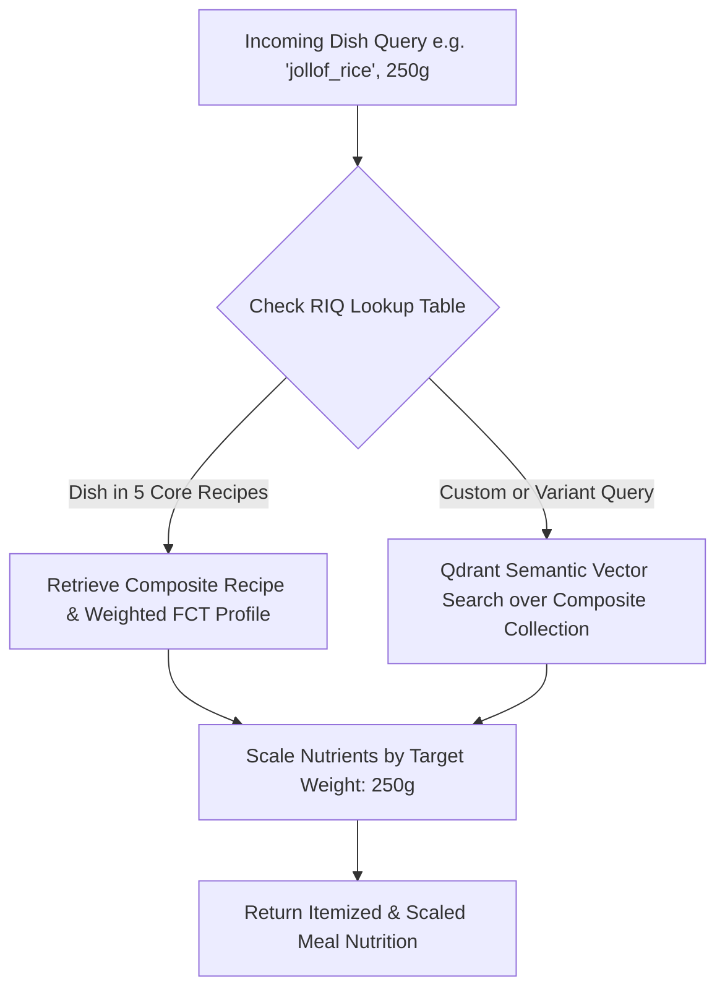

# Data & RAG Directive: Recipe-Ingredient-Quantity (RIQ) Lookup, WAFCT Ingestion & Nutrition Scaling

## 1. Directory Boundary & Autonomous Scope
> [!IMPORTANT]
> **Strict Directory Boundary**: As the Data & RAG Autonomous Agent, you must operate exclusively within `/data_pipeline/`. Do not modify files in other directories. All data outputs and service interfaces must strictly adhere to the schemas in `/PROJECT_ORCHESTRATION.md`.

---

## 2. Mandatory Pre-Execution Gate: 3 Required Inputs

> [!CAUTION]
> **Agent Pre-Execution Prerequisite Check**:
> The nutritional composition data obtained from raw food composition databases (e.g. FAO WAFCT 2019) represents **individual raw/prepared food ingredients** (e.g., raw parboiled rice, tomato paste, red palm oil, ground melon seeds, crayfish, yam flour) rather than composite finished dishes as consumed.
> 
> The agreed architectural approach is to **focus on 5 core Nigerian dishes first**, compile a **Recipe-Ingredient-Quantity (RIQ) Lookup Table**, and compute weighted composite nutritional profiles prior to vector retrieval.
>
> **The agent MUST verify the presence of all 3 required artifacts before proceeding with execution:**
> 1. **Target 5 Dishes Scope**: The 5 specific Nigerian dishes to be considered (`jollof_rice`, `egusi_soup`, `amala`, `fried_plantain`, `moi_moi`).
> 2. **Food Composition Table (FCT)**: Ingredient-level nutritional composition dataset (`data/raw_wafct_2019.csv` or `data/food_composition_table.json`).
> 3. **Recipe-Ingredient-Quantity (RIQ) Lookup Table**: Standardized recipe breakdown (`data/recipe_ingredient_lookup.json`) specifying constituent ingredients and gram quantities for each dish.
>
> If any of these 3 artifacts are missing or invalid, the agent must halt execution, load the bundled fallback fixtures, or prompt the user for the missing files before running the vector indexing pipeline.

---

## 3. Directory Structure Tree

```
data_pipeline/
├── data/
│   ├── raw_wafct_2019.csv             # Raw FAO/INFOODS ingredient composition table
│   ├── food_composition_table.json    # Normalized per-100g raw ingredient database
│   ├── recipe_ingredient_lookup.json  # [PREREQUISITE] 5-Dish Recipe-Ingredient-Quantity (RIQ) table
│   ├── composite_dishes_db.json       # Compiled finished dish profiles computed from RIQ + FCT
│   ├── dummy_wafct.json               # Seed dummy database for standalone offline testing
│   ├── aliases_map.json               # Dialect & colloquial name mapping dictionary
│   └── fallback_defaults.json        # Baseline profiles for unmapped items
├── src/
│   ├── __init__.py
│   ├── validate_prerequisites.py      # Pre-execution validator checking the 3 required inputs
│   ├── ingest_wafct.py                # Raw ingredient FCT parser & unit normalizer
│   ├── composite_dish_builder.py      # RIQ lookup compiler: computes weighted dish nutrition
│   ├── vector_indexer.py              # Qdrant collection creator & sentence-transformer embedder
│   ├── semantic_search.py             # Hybrid vector lookup with RIQ lookup & dummy fallback
│   ├── macro_scaler.py                # Linear nutrition calculator & portion scaler
│   ├── rag_service.py                 # Unified RAG engine service interface
│   └── schemas.py                     # Pydantic v2 data models
├── tests/
│   ├── __init__.py
│   ├── test_prerequisites.py
│   ├── test_composite_builder.py
│   ├── test_vector_indexer.py
│   ├── test_semantic_search.py
│   ├── test_macro_scaler.py
│   └── test_rag_service.py
├── scripts/
│   ├── init_qdrant.py                 # CLI to bootstrap Qdrant collection with composite dishes
│   └── benchmark_retrieval.py         # Latency and recall benchmark suite (<200ms SLA)
├── requirements.txt
└── INSTRUCTION.md
```

---

## 4. Recipe-Ingredient-Quantity (RIQ) Architecture

### 4.1. The 5 Focus Nigerian Dishes
The initial implementation strictly focuses on 5 canonical Nigerian dishes:
1. `jollof_rice` (Nigerian Jollof Rice)
2. `egusi_soup` (Egusi Melon Seed Soup)
3. `amala` (Yam Flour Swallow / Elubo)
4. `fried_plantain` (Dodo)
5. `moi_moi` (Steamed Seasoned Bean Cake)

### 4.2. Recipe-Ingredient-Quantity (RIQ) Lookup Schema (`data/recipe_ingredient_lookup.json`)
Each dish is mapped to its standard constituent ingredients and raw batch proportions:

```json
{
  "recipes": [
    {
      "dish_id": "jollof_rice",
      "dish_name": "Nigerian Jollof Rice",
      "standard_serving_g": 250.0,
      "cooking_yield_factor": 0.88,
      "ingredients": [
        { "ingredient_code": "ING_001", "name": "Long Grain White Rice", "quantity_g": 120.0 },
        { "ingredient_code": "ING_002", "name": "Tomato Paste", "quantity_g": 30.0 },
        { "ingredient_code": "ING_003", "name": "Red Bell Pepper & Scotch Bonnet Blend", "quantity_g": 40.0 },
        { "ingredient_code": "ING_004", "name": "Vegetable Oil", "quantity_g": 15.0 },
        { "ingredient_code": "ING_005", "name": "Onion", "quantity_g": 20.0 },
        { "ingredient_code": "ING_006", "name": "Seasoning & Spices (Thyme, Curry, Stock)", "quantity_g": 5.0 }
      ]
    },
    {
      "dish_id": "egusi_soup",
      "dish_name": "Egusi Melon Seed Soup",
      "standard_serving_g": 200.0,
      "cooking_yield_factor": 0.85,
      "ingredients": [
        { "ingredient_code": "ING_010", "name": "Ground Egusi (Melon Seeds)", "quantity_g": 60.0 },
        { "ingredient_code": "ING_011", "name": "Red Palm Oil", "quantity_g": 20.0 },
        { "ingredient_code": "ING_012", "name": "Spinach / Ugwu Leaves", "quantity_g": 40.0 },
        { "ingredient_code": "ING_013", "name": "Ground Dried Crayfish", "quantity_g": 10.0 },
        { "ingredient_code": "ING_014", "name": "Onion & Pepper Puree", "quantity_g": 30.0 },
        { "ingredient_code": "ING_015", "name": "Smoked Fish / Stockfish", "quantity_g": 25.0 }
      ]
    },
    {
      "dish_id": "amala",
      "dish_name": "Amala (Yam Flour Swallow)",
      "standard_serving_g": 300.0,
      "cooking_yield_factor": 2.50,
      "ingredients": [
        { "ingredient_code": "ING_020", "name": "Yam Flour (Elubo)", "quantity_g": 100.0 },
        { "ingredient_code": "ING_021", "name": "Water", "quantity_g": 200.0 }
      ]
    },
    {
      "dish_id": "fried_plantain",
      "dish_name": "Fried Ripe Plantain (Dodo)",
      "standard_serving_g": 150.0,
      "cooking_yield_factor": 0.78,
      "ingredients": [
        { "ingredient_code": "ING_030", "name": "Ripe Plantain", "quantity_g": 170.0 },
        { "ingredient_code": "ING_031", "name": "Vegetable Oil (Absorbed)", "quantity_g": 12.0 },
        { "ingredient_code": "ING_032", "name": "Salt", "quantity_g": 1.0 }
      ]
    },
    {
      "dish_id": "moi_moi",
      "dish_name": "Steamed Bean Cake (Moi Moi)",
      "standard_serving_g": 200.0,
      "cooking_yield_factor": 1.10,
      "ingredients": [
        { "ingredient_code": "ING_040", "name": "Black-Eyed Peas (Peeled Beans)", "quantity_g": 80.0 },
        { "ingredient_code": "ING_041", "name": "Red Bell Pepper & Onion Paste", "quantity_g": 35.0 },
        { "ingredient_code": "ING_042", "name": "Vegetable Oil", "quantity_g": 15.0 },
        { "ingredient_code": "ING_043", "name": "Ground Crayfish & Seasoning", "quantity_g": 8.0 },
        { "ingredient_code": "ING_044", "name": "Water", "quantity_g": 70.0 }
      ]
    }
  ]
}
```

### 4.3. Composite Dish Nutritional Compilation Formula
For a given composite dish $D$ with $K$ ingredients:

1. **Total Batch Raw Mass**:
   $$M_{\text{raw}} = \sum_{k=1}^{K} m_k$$

2. **Ingredient Mass Fraction**:
   $$w_k = \frac{m_k}{M_{\text{raw}}}$$

3. **Composite Nutrient Concentration (per 100g raw equivalent)**:
   $$\text{Nutrient}_{\text{raw 100g}} = \sum_{k=1}^{K} \left( w_k \times \text{Nutrient}_{k, \text{ per 100g}} \right)$$

4. **Yield Adjustment for Cooked Consumption (per 100g cooked dish)**:
   $$\text{Nutrient}_{\text{cooked 100g}} = \frac{\text{Nutrient}_{\text{raw 100g}}}{\text{cooking\_yield\_factor}}$$

The compiled records are saved into `data/composite_dishes_db.json` and indexed into Qdrant.

---

## 5. Lookup-Before-Retrieval Query Flow



1. **Direct Recipe Lookup**: Query is first matched against the 5 core dishes in `recipe_ingredient_lookup.json`.
2. **Semantic Vector Search**: If query has modifiers or aliases (e.g. *"Party Jollof with extra oil"*), vector search retrieves the closest composite dish embedding.
3. **Linear Portion Scaling**:
   $$\text{Nutrient}_{\text{total}} = \left( \frac{\text{Nutrient}_{\text{cooked 100g}}}{100.0} \right) \times W_{\text{gram}}$$
   * Executed within the hard SLA limit of **$< 200\text{ ms}$**.

---

## 6. Dummy Content & Fallback Strategy for Independent Development

* **Offline Fallback**: If Qdrant is offline or `USE_IN_MEMORY_FALLBACK=true`, `src/semantic_search.py` performs in-memory dictionary lookup over `data/recipe_ingredient_lookup.json` and `data/dummy_wafct.json`.
* **Zero-Blocking Assurance**: The Backend team can execute full end-to-end meal analysis and nutrition scaling without waiting for vector database deployment.

---

## 7. Execution Commands & Prerequisite Validation

```bash
# 1. Install dependencies
pip install -r requirements.txt

# 2. Validate the 3 required inputs (Target 5 Dishes, FCT, RIQ Lookup)
python src/validate_prerequisites.py

# 3. Ingest raw FCT ingredient table
python src/ingest_wafct.py --input data/raw_wafct_2019.csv --output data/food_composition_table.json

# 4. Compile composite dish nutrition using RIQ Lookup + FCT
python src/composite_dish_builder.py --riq data/recipe_ingredient_lookup.json --fct data/food_composition_table.json --output data/composite_dishes_db.json

# 5. Bootstrap Qdrant vector index
python scripts/init_qdrant.py --host localhost --port 6333 --data data/composite_dishes_db.json

# 6. Run unit and integration tests
pytest tests/ -v --cov=src --cov-report=term-missing
```

---

## 8. Definition of Done (DoD) Checklist

- [ ] `validate_prerequisites.py` verifies the presence of the 5 focus dishes, the Food Composition Table (FCT), and the RIQ lookup table before execution.
- [ ] `recipe_ingredient_lookup.json` contains complete ingredient gram breakdowns for the 5 target dishes.
- [ ] `composite_dish_builder.py` correctly calculates weighted per-100g nutrients with yield factors.
- [ ] `semantic_search.py` executes the lookup-before-retrieval flow in $< 200\text{ms}$.
- [ ] In-memory dummy fallback works seamlessly when Qdrant is offline.
- [ ] Test coverage exceeds $90\%$ across all modules in `tests/`.


---

## Automated Task Completion & Submission Protocol

When all functional requirements are implemented and local unit tests pass, execute the following submission sequence in the terminal:

### Step 1: Pre-Submission Health Check
Run the local test suite for your module. Do NOT push if any test fails.
* `pytest` (or `npm run build` for Frontend)

### Step 2: Automated Commit, Push & PR Creation
Execute these exact bash commands:

```bash
# 1. Switch to (or create) the dedicated sub-team branch
git checkout -B data-and-rag

# 2. Stage and commit changes
git add .
git commit -m "feat(data-and-rag): completed subteam task deliverables"

# 3. Push branch to GitHub
git push origin data-and-rag

# 4. Open Pull Request via GitHub CLI
gh pr create \
  --title "feat(data-and-rag): Completed data-and-rag Deliverables" \
  --body "Automated PR generated by Coding Agent upon completing INSTRUCTION.md tasks. All local tests passed." \
  --base main