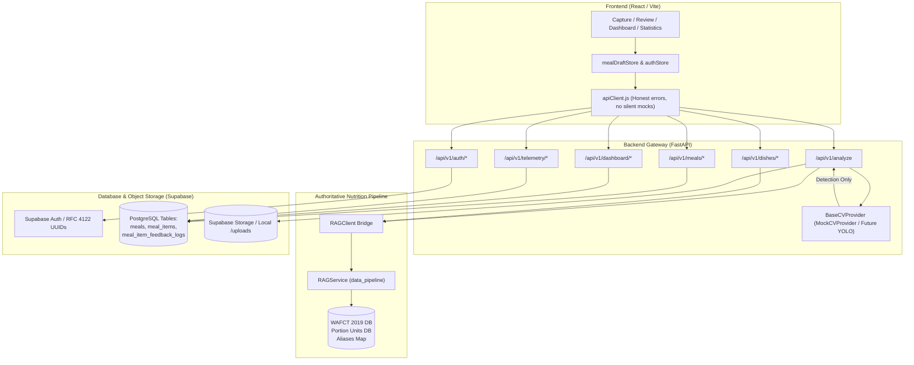

# Docta — Comprehensive System Walkthrough & Roadmap

This document provides a complete overview of the Docta architecture, the end-to-end integration completed across Phases 0–17, instructions on running and verifying the application, what remains to be done for production readiness, and step-by-step guidance on how to accomplish each remaining item.

---

## 1. Executive Summary & Architecture

**Docta** is an AI-assisted nutrition logging application tailored specifically to West African cuisine. It identifies Nigerian and West African dishes from food images, attaches authoritative nutritional profiles grounded in the **FAO/INFOODS West African Food Composition Table (WAFCT 2019)**, enables interactive portion sizing (both standard household utensils and custom gram measurements), persists meals to a database, and records active learning telemetry.

### Core Architectural Principle
A strict boundary separates food identification from nutritional intelligence:

- **Computer Vision (CV):** Responsible **only** for food detection and localization (`dish_id`, `display_name`, `confidence`, `bounding_box`). The CV model never estimates calories, macros, or gram weights.
- **RAG & Nutrition Pipeline:** Owned by `RAGService` (`backend/src/data_pipeline/`). It is the **sole authoritative source** for base nutrient profiles (per 100g), portion units (serving spoons, wraps, mounds, cups), alias resolution (`dodo` → `fried_plantain`), and nutrient scaling.
- **Backend Gateway (FastAPI):** Bridges the frontend, CV provider, RAG service, and Supabase data layer while enforcing JWT authentication, RFC 4122 user UUID isolation, and input validation.
- **Client (React / Vite):** Mobile-first UI consuming real API endpoints, displaying honest errors, and presenting zero-state and live data dynamically without synthetic hardcoded fallbacks.



---

## 2. Completed Implementation (Phases 0–17)

All 17 phases defined in `END_TO_END.md` are completed and verified:

1. **Phase 1 — Frontend → FastAPI Connection:** `apiClient.js` configures base URL, auth headers, content negotiation (`application/json` and `text/csv`), and honest error throwing without silent mock fallbacks.
2. **Phase 2 — Real Authentication:** Supabase JWT authentication flow (`signup`, `login`, `logout`, `/auth/me`). Generates valid RFC 4122 UUIDs and revokes sessions on logout.
3. **Phase 3 — Authorization and User Isolation:** Enforced `get_current_user` across all protected routes (`analyze`, `meals/log`, `meals/history`, `meals/{id}`, `dashboard`, `profile`). User A cannot access User B's meals.
4. **Phase 4 — Data Pipeline Integration:** `RAGClient` integrates directly with `RAGService(force_memory=True)` in `backend/src/data_pipeline/`. Sub-millisecond lookup across canonical tables with zero frontend nutrition duplication.
5. **Phase 5 — Analyze Flow:** `POST /api/v1/analyze` accepts multipart image uploads and text prompts, passes image to CV provider for detection, queries RAG for portion units and 100g WAFCT nutrition, and returns `AnalyzeResponse`.
6. **Phase 6 — Food Correction & Dish Resolution:** `GET /api/v1/dishes/{dish_id}` resolves canonical dishes and regional aliases (e.g., `dodo` resolves to `fried_plantain`), returning canonical nutrients and portion options.
7. **Phase 7 — Portion Units & Custom Grams Scaling:** Supports both standard Nigerian household measures (serving spoon, small bowl, wrap, mound) and custom gram inputs (`custom_grams`) with live client-side macro calculation.
8. **Phase 8 — Image Storage:** Persists uploaded meal photos to Supabase Storage (with fallback to local `/uploads/{file_id}` server). Prevents transient `blob:` URLs from entering the database.
9. **Phase 9 — Meal Logging:** `POST /api/v1/meals/log` writes parent meal records, child meal items, and active learning feedback logs into Supabase tables (`meals`, `meal_items`, `meal_item_feedback_logs`).
10. **Phase 10 — Real History:** `GET /api/v1/meals/history` returns chronological user-scoped meal logs with full item breakdowns.
11. **Phase 11 — Real Dashboard:** `GET /api/v1/dashboard/summary` dynamically calculates today's calories, macro breakdown, target progress, and recent meals, with a clean empty state when no meals are logged.
12. **Phase 12 — Real Statistics:** `StatisticScreen` and `WeeklyCalorieBarChart` dynamically render daily calorie bars and averages calculated from actual persisted history.
13. **Phase 13 & 14 — Active Learning Telemetry & Export:** `GET /api/v1/telemetry/export` streams user decision logs in JSON or CSV format, recording original predictions, user modifications, selected portions, and gram weights for ML retraining.
14. **Phase 15 — CV Provider Abstraction:** Formalized `BaseCVProvider` protocol in `cv_client.py`. `MockCVProvider` fulfills this contract; future YOLO models plug in seamlessly.
15. **Phase 16 — End-to-End Verification:** `backend/tests/test_end_to_end_flow.py` validates the entire 9-step flow in a single automated integration test.
16. **Phase 17 — Cleanup:** Removed unused mock imports, eliminated hardcoded calorie defaults (456 kcal), and ensured production configuration hygiene.

---

## 3. How to Run the Application Locally

### Prerequisites
- **Python 3.12+** (tested on Python 3.13)
- **Node.js 18+** and **npm**
- PowerShell or Bash shell

### 1. Start the Backend API Server
```powershell
# Navigate to project root
cd c:\Users\Fouad\Downloads\docta

# Ensure virtual environment dependencies are activated
$env:PYTHONPATH="."
& backend\.venv\Scripts\python.exe -m uvicorn src.main:app --host 127.0.0.1 --port 8000 --app-dir backend --reload
```
The backend API will be available at:
- **API Base:** `http://127.0.0.1:8000`
- **Interactive Swagger Docs:** `http://127.0.0.1:8000/docs`
- **ReDoc:** `http://127.0.0.1:8000/redoc`
- **Health Check:** `http://127.0.0.1:8000/health`

### 2. Start the Frontend Development Server
In a separate terminal:
```powershell
cd c:\Users\Fouad\Downloads\docta\frontend

# Install dependencies if not already installed
npm install

# Start Vite development server
npm run dev
```
The frontend UI will be available at:
- **Application URL:** `http://localhost:5173`

---

## 4. Verification & Testing

### Run All Backend Tests (34 Tests)
```powershell
cd c:\Users\Fouad\Downloads\docta
& backend\.venv\Scripts\pytest backend\tests -v
```
Output: `34 passed in ~1.1s` covering:
- Auth & Session Invalidation (`test_auth.py`)
- End-to-End Flow (`test_end_to_end_flow.py`)
- Analyze & RAG Attachment (`test_analyze_flow.py`)
- Dish Resolution & Aliases (`test_dishes.py`)
- Meal Logging & Telemetry (`test_meals_and_telemetry.py`)
- Dashboard Summary (`test_dashboard.py`)
- User Profile (`test_profile.py`)
- Telemetry Export (`test_telemetry_export.py`)
- Health Check (`test_health.py`)

### Run Frontend Unit Tests (11 Tests)
```powershell
cd c:\Users\Fouad\Downloads\docta\frontend
npm test -- --run
```
Output: `11 passed` covering:
- `macroCalculator.test.js`
- `PortionUnitSelector.test.tsx`
- `FoodItemCard.test.tsx`
- `CameraFeed.test.tsx`
- `BoundingOverlay.test.tsx`

### Verify Production Frontend Build
```powershell
cd c:\Users\Fouad\Downloads\docta\frontend
npm run build
```
Output: `vite build` cleanly outputs optimized assets to `frontend/dist/`.

---

## 5. What Remains to Be Done (Roadmap)

While the application logic, API contracts, RAG pipeline, and UI flows are fully integrated, the following items are required for production deployment:

| Priority | Task | Description |
| :--- | :--- | :--- |
| **High** | **1. Real CV Model Integration** | Replace `MockCVProvider` with a trained YOLO model (e.g. YOLOv8 / YOLOv11) trained on Nigerian dishes. |
| **High** | **2. Live Supabase Project Setup** | Deploy `supabase_schema.sql` to a live Supabase PostgreSQL project and configure live API keys. |
| **Medium** | **3. Qdrant Cloud Vector Search** | Connect an external Qdrant instance for open-ended natural language dish queries. |
| **Medium** | **4. Docker Containerization** | Create production Dockerfiles and a `docker-compose.yml` for unified local/cloud deployment. |
| **Medium** | **5. Automated CI/CD Pipeline** | Configure GitHub Actions to execute backend tests, frontend tests, and build checks on pull requests. |
| **Low** | **6. Progressive Web App (PWA) / Mobile App** | Add service worker offline caching or wrap in Capacitor for iOS/Android App Store distribution. |

---

## 6. How to Go About Doing What Remains

### Task 1: Real Computer Vision Model Integration

The system was designed so the CV layer is pluggable without touching existing routes or the RAG pipeline.

#### Step 1.1: Install Computer Vision Inference Dependencies
In `backend/requirements.txt`, add:
```text
ultralytics>=8.1.0
torch>=2.2.0
torchvision>=0.17.0
Pillow>=10.0.0
```
Install them into the virtual environment:
```powershell
& backend\.venv\Scripts\pip install ultralytics torch torchvision Pillow
```

#### Step 1.2: Implement `YOLOCVProvider` in `backend/src/services/cv_client.py`
Open [`backend/src/services/cv_client.py`](file:///c:/Users/Fouad/Downloads/docta/backend/src/services/cv_client.py) and add the class implementing `BaseCVProvider`:
```python
import io
from typing import List, Optional
from PIL import Image
from .cv_client import BaseCVProvider, DetectionResult

class YOLOCVProvider(BaseCVProvider):
    def __init__(self, model_weights_path: str = "models/docta_yolov8_nigerian_dishes.pt"):
        from ultralytics import YOLO
        self.model = YOLO(model_weights_path)

    def detect(self, image_bytes: bytes, prompt: Optional[str] = None) -> List[DetectionResult]:
        image = Image.open(io.BytesIO(image_bytes)).convert("RGB")
        results = self.model.predict(source=image, conf=0.25)
        
        detections = []
        for result in results:
            boxes = result.boxes
            for box in boxes:
                cls_id = int(box.cls[0])
                class_name = result.names[cls_id]
                conf = float(box.conf[0])
                # Normalized coordinates [ymin, xmin, ymax, xmax]
                x1, y1, x2, y2 = box.xyxyn[0].tolist()
                
                # Standardize dish_id to lowercase underscore format
                dish_id = class_name.lower().replace(" ", "_")
                display_name = class_name.replace("_", " ").title()
                
                detections.append(
                    DetectionResult(
                        dish_id=dish_id,
                        display_name=display_name,
                        confidence=round(conf, 2),
                        bounding_box=[round(y1, 4), round(x1, 4), round(y2, 4), round(x2, 4)],
                    )
                )
        return detections
```

#### Step 1.3: Update Provider Selection
In `cv_client.py`, update `get_cv_provider()`:
```python
def get_cv_provider(settings: Settings = Depends(get_settings)) -> BaseCVProvider:
    if settings.USE_MOCK_AI:
        return MockCVProvider()
    return YOLOCVProvider(model_weights_path=getattr(settings, "YOLO_WEIGHTS_PATH", "models/best.pt"))
```
In `backend/.env`, set:
```ini
USE_MOCK_AI=false
YOLO_WEIGHTS_PATH=models/docta_yolov8_best.pt
```

---

### Task 2: Live Supabase Project Setup

Currently, if dummy Supabase credentials are present, the app falls back to `InMemorySupabaseClient`. To connect to live Supabase:

#### Step 2.1: Create a Supabase Project
1. Log into [Supabase Dashboard](https://app.supabase.com) and create a new project (e.g., `docta-prod`).
2. Copy the **Project URL**, **anon key**, and **service_role key** from *Settings → API*.

#### Step 2.2: Apply Database Schema
1. In the Supabase Dashboard, open the **SQL Editor**.
2. Paste and run the entire contents of [`backend/supabase_schema.sql`](file:///c:/Users/Fouad/Downloads/docta/backend/supabase_schema.sql).
3. This creates:
   - `user_profiles` table with nutritional target defaults.
   - `meals` table for logged meals.
   - `meal_items` table with nutritional breakdowns.
   - `meal_item_feedback_logs` table for telemetry.
   - Row Level Security (RLS) policies ensuring users only access their own data.

#### Step 2.3: Create Storage Bucket
1. In Supabase Dashboard, navigate to **Storage**.
2. Create a new bucket named `meals`.
3. Set the bucket to **Public** (or configure a read-only policy for authenticated users) so image URLs are accessible.

#### Step 2.4: Update Environment Configuration
In `backend/.env`:
```ini
SUPABASE_URL=https://<your-project-ref>.supabase.co
SUPABASE_KEY=<your-anon-key>
SUPABASE_SERVICE_ROLE_KEY=<your-service-role-key>
```
Once configured, `backend/src/supabase_client.py` will automatically initialize the real `supabase.Client` instead of the in-memory fallback.

---

### Task 3: Vector Database Deployment (Qdrant)

The app currently runs `RAGService(force_memory=True)`, reading canonical JSON composition datasets with exact ID and alias lookups. To enable semantic natural language food search (e.g., searching *"something with egusi and bitterleaf"*):

#### Step 3.1: Provision Qdrant
- **Option A (Qdrant Cloud):** Create a free cluster on [cloud.qdrant.io](https://cloud.qdrant.io).
- **Option B (Docker Local):**
  ```bash
  docker run -p 6333:6333 -v qdrant_storage:/qdrant/storage qdrant/qdrant
  ```

#### Step 3.2: Configure Environment
In `backend/.env`:
```ini
QDRANT_URL=https://<your-cluster>.qdrant.tech:6333
QDRANT_API_KEY=<your-api-key>
OPENAI_API_KEY=<your-openai-key> # or HuggingFace embedding key
```

#### Step 3.3: Run Ingestion Script
Execute the existing pipeline vector indexing script in `backend/src/data_pipeline/`:
```powershell
& backend\.venv\Scripts\python.exe -m src.data_pipeline.ingest
```

---

### Task 4: Docker Containerization

To run the entire system in containers:

#### Step 4.1: Backend `Dockerfile`
Create `backend/Dockerfile`:
```dockerfile
FROM python:3.12-slim

WORKDIR /app

RUN apt-get update && apt-get install -y --no-install-recommends \
    build-essential curl libgl1-mesa-glx libglib2.0-0 \
    && rm -rf /var/lib/apt/lists/*

COPY requirements.txt .
RUN pip install --no-cache-dir -r requirements.txt

COPY . .

EXPOSE 8000
CMD ["uvicorn", "src.main:app", "--host", "0.0.0.0", "--port", "8000"]
```

#### Step 4.2: Frontend `Dockerfile`
Create `frontend/Dockerfile`:
```dockerfile
FROM node:20-alpine AS builder
WORKDIR /app
COPY package*.json ./
RUN npm ci
COPY . .
RUN npm run build

FROM nginx:alpine
COPY --from=builder /app/dist /usr/share/nginx/html
COPY nginx.conf /etc/nginx/conf.d/default.conf
EXPOSE 80
CMD ["nginx", "-g", "daemon off;"]
```

#### Step 4.3: Root `docker-compose.yml`
Create `docker-compose.yml` in the project root:
```yaml
version: '3.8'

services:
  backend:
    build:
      context: ./backend
      dockerfile: Dockerfile
    ports:
      - "8000:8000"
    env_file:
      - ./backend/.env
    volumes:
      - uploads_data:/app/uploads

  frontend:
    build:
      context: ./frontend
      dockerfile: Dockerfile
    ports:
      - "80:80"
    environment:
      - VITE_API_URL=http://localhost:8000
    depends_on:
      - backend

volumes:
  uploads_data:
```

---

### Task 5: CI/CD Pipeline Setup

Create `.github/workflows/ci.yml` to automatically validate all commits and pull requests:

```yaml
name: Docta CI

on:
  push:
    branches: [ main, master ]
  pull_request:
    branches: [ main, master ]

jobs:
  backend-tests:
    runs-on: ubuntu-latest
    steps:
      - uses: actions/checkout@v4
      - name: Set up Python
        uses: actions/setup-python@v5
        with:
          python-version: '3.12'
          cache: 'pip'
      - name: Install Dependencies
        run: |
          python -m pip install --upgrade pip
          pip install -r backend/requirements.txt
      - name: Run Pytest Suite
        env:
          PYTHONPATH: .
        run: |
          pytest backend/tests -v

  frontend-tests:
    runs-on: ubuntu-latest
    steps:
      - uses: actions/checkout@v4
      - name: Set up Node.js
        uses: actions/setup-node@v4
        with:
          node-version: '20'
          cache: 'npm'
          cache-dependency-path: frontend/package-lock.json
      - name: Install Dependencies
        working-directory: frontend
        run: npm ci
      - name: Run Frontend Tests
        working-directory: frontend
        run: npm test -- --run
      - name: Run Production Build
        working-directory: frontend
        run: npm run build
```

---

### Task 6: Progressive Web App (PWA) / Mobile App

Because Docta is designed for mobile usage (camera scanning during meals):

#### Step 6.1: PWA Integration (Vite PWA Plugin)
1. In `frontend/`:
   ```bash
   npm install -D vite-plugin-pwa
   ```
2. In `frontend/vite.config.js`:
   ```javascript
   import { VitePWA } from 'vite-plugin-pwa';

   export default defineConfig({
     plugins: [
       react(),
       VitePWA({
         registerType: 'autoUpdate',
         manifest: {
           name: 'Docta Nutrition Tracker',
           short_name: 'Docta',
           description: 'AI-assisted West African Nutrition Logging',
           theme_color: '#4f46e5',
           icons: [
             { src: '/icon-192.png', sizes: '192x192', type: 'image/png' },
             { src: '/icon-512.png', sizes: '512x512', type: 'image/png' }
           ]
         }
       })
     ]
   });
   ```

#### Step 6.2: Native App Store (Capacitor)
If a native iOS/Android binary is required:
```bash
cd frontend
npm install @capacitor/core @capacitor/cli @capacitor/camera
npx cap init Docta ng.docta.app
npx cap add android
npx cap add ios
npm run build
npx cap sync
```

---

## 7. Summary Checklist

- [x] Base client configuration with honest error handling (`apiClient.js`)
- [x] Real Supabase JWT authentication & session invalidation (`auth_router.py`)
- [x] Authorization and user isolation across all endpoints
- [x] Authoritative RAG data pipeline connection (`RAGService(force_memory=True)`)
- [x] Analyze endpoint with CV identification & portion units attachment
- [x] Food correction endpoint (`/api/v1/dishes/{dish_id}`) resolving Nigerian aliases
- [x] Portion unit selector supporting conventional measures and custom grams
- [x] Image persistence without `blob:` URLs in database
- [x] Meal logging persisting to `meals`, `meal_items`, and `meal_item_feedback_logs`
- [x] Real meal history ordered by timestamp descending
- [x] Real dashboard summary with live macro calculation and empty state
- [x] Dynamic statistics and weekly calorie chart
- [x] Active learning telemetry recording
- [x] Telemetry dataset export in JSON and CSV formats
- [x] Pluggable `BaseCVProvider` abstraction
- [x] Comprehensive end-to-end integration test (`test_end_to_end_flow.py`)
- [x] Cleanup of unused imports and hardcoded defaults
- [ ] Train & plug in production YOLO weights to `YOLOCVProvider`
- [ ] Connect production Supabase project with `supabase_schema.sql`
- [ ] Containerize via Docker & configure CI/CD pipeline
